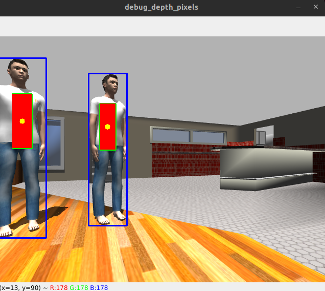

# Perception in robotics

#### Real-time RGB-D perception pipeline for estimating stable 3D target positions using GPU-accelerated inference.


# What this project does

This system takes RGB, Depth images outputs 3D position (X, Y, Z) of detected objects in real time

Designed as a perception spine for robotics applications like:

object tracking
navigation
human-robot interaction

---

## 📌 System Overview

Below is multi-stage perception pipeline:

```
RGB Image ──▶ YOLO (TensorRT) ──▶ 2D Detections
                                     │
Depth Image ──────────────────────────┘
                                     ▼
                          ROI Depth Filtering
                                     ▼
                         Robust Depth Estimation
                                     ▼
                        2D → 3D Projection
                                     ▼
                         Target Selection
                                     ▼
                         Temporal Smoothing
                                     ▼
                    /perception/target_3d (ROS2)
```

---

## Performance - [Currently pure py-cuda tensorrt]

| Stage       | Latency     |
| ----------- | ----------- |
| Preprocess  | ~3.4 ms     |
| Inference   | ~1.1 ms     |
| Postprocess | ~0.05 ms    |
| **Total**   | **~4.5 ms** |

**~220 FPS pipeline capability**

---

## Key Features

* Real-time inference using TensorRT (FP16)
* 3D spatial reasoning from RGB-D data
* Robust depth filtering (ROI + percentile sampling)
* Camera model-based projection
* Temporal smoothing for stability
* ROS2 Lifecycle (Managed node) based system design

---
## 🔧 Setup

### 1. Requirements

* Ubuntu 22.04 (Jammy)
* Ros2 Humble
* Gazebo
* Yolo26(ONNX → TensorRT)
* Python 3.8+
* CUDA
* TensorRT
* PyCUDA
* OpenCV


---
## Project Structure

```
└── perception_robotics
    ├── assets
    │   └──detection_out.png
    ├── bridge_config.yaml
    ├── docker-compose.yaml
    ├── Dockerfile
    └── src
        └── perception_deployment
            ├── config
            │   └── params.yaml
            ├── launch
            │   ├── perception.launch.py
            │   └── simulation.launch.py
            ├── models
            │   ├── cafe
            │   ├── cafe_world.sdf
            │   ├── export.onnx.py
            │   ├── person_standing
            │   ├── realsense_rig
            │   └── yolo.engine
            ├── package.xml
            ├── perception_deployment
            │   ├── perception_node.py
            │   └── trt_bridge.py
            ├── resource
            │   └── perception_deployment
            ├── setup.cfg
            └── setup.py
           
```

---


### 2. Instructions to Run

```
# Clone 

git clone https://github.com/deshmanea/perception_robotics.git

# Build Project

cd ~/ros2_ws
source /opt/ros/humble/setup.bash
colcon build --packages-select perception_deployment --symlink-install
source install/setup.bash

___________________________________________________________________________________________________
# Terminal 1

cd ~/ros2_ws/src/perception_robotics/src/perception_deployment/models
gazebo cafe_world.sdf

confrim -> gz topic -l
___________________________________________________________________________________________________

# No need to explicitly create bridge for Gazebo classic -> New Gazebo need bridge to be installed

confirm -> ros2 topic list
________________________________________________________________________________________________
# Terminal 2

cd ~/ros2_ws/src/perception_robotics/src/perception_deployment/perception_deployment

source /opt/ros/humble/setup.bash
source ~/ros2_ws/install/setup.bash
source /home/abhijit/ros2_ws/.venv/bin/activate


python3 perception_node.py

________________________________________________________________________________________________
# Terminal 3

cd ~/ros2_ws/src/perception_robotics/src/perception_deployment
source /opt/ros/humble/setup.bash
source ~/ros2_ws/install/setup.bash

ros2 lifecycle nodes

ros2 lifecycle set /perception_engine configure

ros2 lifecycle set /perception_engine activate

```

---

## 🧪 Pipeline Details

### Preprocessing

* Resize to 640×640
* Normalize to [0,1]
* Convert HWC → CHW
* Batch dimension added

### Inference

* TensorRT engine execution
* GPU memory allocation via PyCUDA

### Postprocessing

* Confidence filtering
* Bounding box scaling to original image

---

## Example Output



<br>
<br>

* Bounding boxes (RGB)

* Filtered depth pixels (red)

* projected 3D target point

## Roadmap

Next steps toward production-level perception:

    [] RGB–Depth synchronization (message_filters)

    [] Object tracking (temporal consistency)

    [] Kalman Filter for state estimation

    [] Multi-object handling