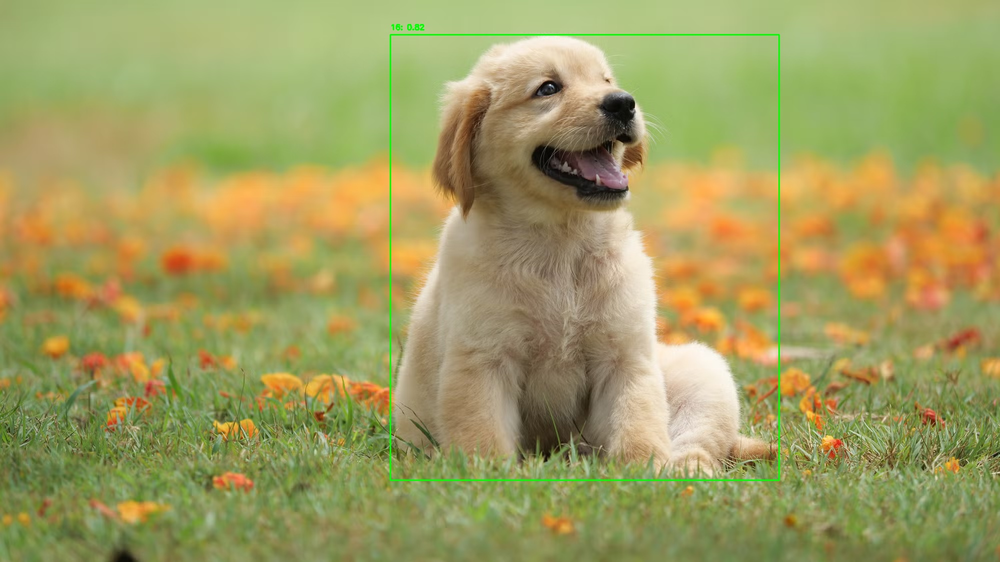

# Perception in robotics


# 🚀 TensorRT Perception Pipeline

High-performance object detection pipeline using TensorRT and PyCUDA, optimized for low-latency inference and designed for robotics deployment.

---

## 📌 Overview

This project implements an end-to-end perception pipeline:

```
Image → Preprocess → TensorRT Inference → Postprocess → Visualization
```

The system is designed with **modularity and performance in mind**, making it suitable for real-time robotics applications.

---

## ⚡ Performance

| Stage       | Latency     |
| ----------- | ----------- |
| Preprocess  | ~3.4 ms     |
| Inference   | ~1.1 ms     |
| Postprocess | ~0.05 ms    |
| **Total**   | **~4.5 ms** |

👉 **~220 FPS pipeline capability**

---

## 🧠 Key Features

* ⚡ TensorRT optimized inference (FP16)
* 🚀 PyCUDA-based GPU memory management
* 🧩 Modular pipeline design
* 📉 Latency measurement with warmup
* 🎯 Detection filtering and scaling
* 🖼️ Visualization utilities

---

## 🗂️ Project Structure

```
perception_deployment/
├── trt/
│   ├── engine.py        # Load TensorRT engine
│   ├── infer.py         # GPU inference + buffer management
│   ├── preprocess.py    # Image preprocessing
│   ├── postprocess.py   # Filtering + scaling
│
├── utils/
│   └── draw.py          # Visualization
│
├── test/
│   └── test_real_inference.py
```

---

## 🔧 Setup

### 1. Requirements

* Python 3.8+
* CUDA
* TensorRT
* PyCUDA
* OpenCV
* NumPy

---

### 2. Run Inference

```
python3 test/test_real_inference.py
```

---

## 🧪 Pipeline Details

### Preprocessing

* Resize to 640×640
* Normalize to [0,1]
* Convert HWC → CHW
* Batch dimension added

### Inference

* TensorRT engine execution
* GPU memory allocation via PyCUDA

### Postprocessing

* Confidence filtering
* Bounding box scaling to original image

---

## 🧠 Key Learnings

* GPU inference is fast, but preprocessing can become the bottleneck
* Separating disk I/O from compute is critical for real-time systems
* CUDA context management is required for PyCUDA
* Memory layout (contiguous arrays) impacts performance


##  🚀 Next Steps

* ROS2 integration for real-time perception
* Asynchronous CUDA streams for pipeline parallelism
* Camera input (video stream)
* Non-Max Suppression (NMS)

## 📸 Example Output

