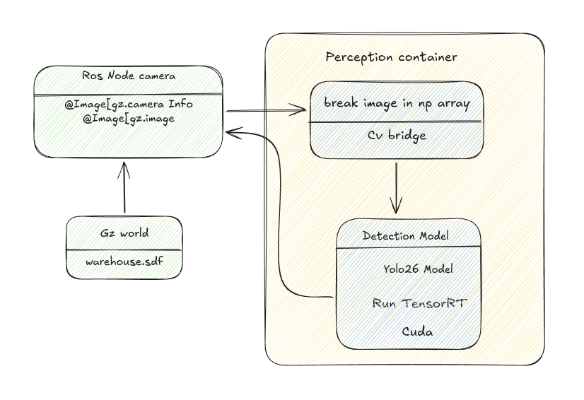

<h2>Perception in robotics<h2>

This repository explores how modern robotics systems integrate simulation, perception, and GPU-accelerated deep learning into a unified pipeline.

The project builds a minimal but complete robot perception stack starting from simulation and progressing toward optimized inference deployment. The system combines ROS2, Gazebo simulation, deep learning perception models, and TensorRT GPU inference to study how perception systems used in robotics and autonomous platforms are structured.

The objective is not only to run object detection, but to understand the full lifecycle of a perception system, including:

- Sensor data acquisition from simulation

- Preprocessing and perception pipelines

- Deep neural network inference

- GPU-optimized deployment with TensorRT

- Integration with robotics middleware

By incrementally building these components, the repository investigates how perception modules evolve from research prototypes to deployable robotics systems.